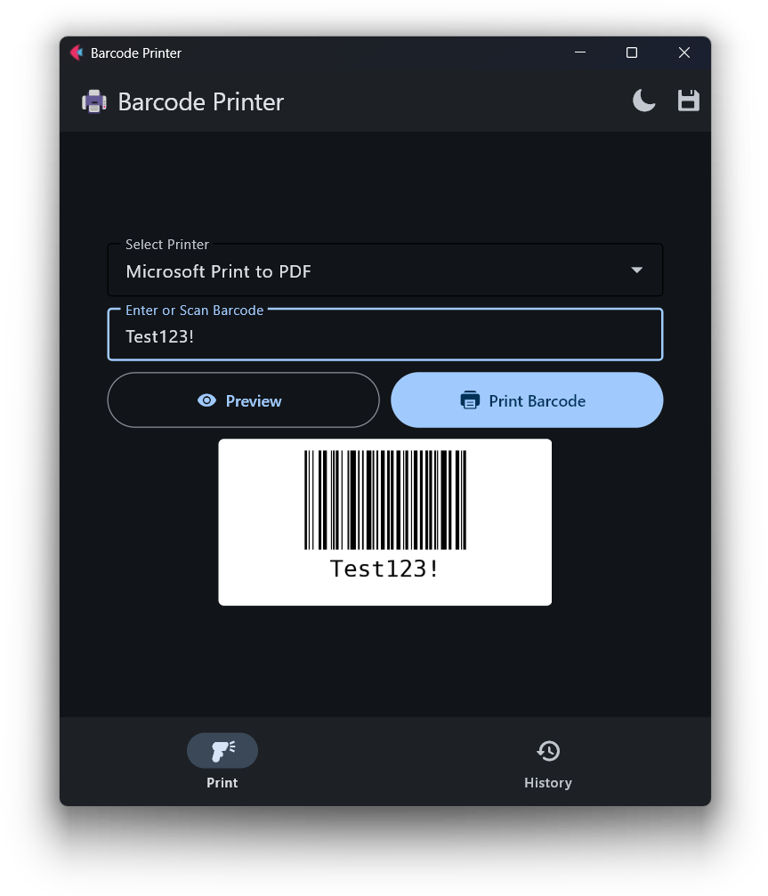

# 🖨️ Barcode Printer

A modern, user-friendly desktop application for generating and printing Code128 barcodes on Windows. Built with Python and Flet for a beautiful native experience.

  

## ✨ Features

- 🎯 **Simple Interface** - Clean, intuitive design for quick barcode printing
- ⌨️ **Barcode Scanner Support** - Scan barcodes directly with USB/Bluetooth scanners
- 🖨️ **Multi-Printer Support** - Select from any installed Windows printer
- 👁️ **Live Preview** - See your barcode before printing
- 📊 **Print History** - Track all printed barcodes with timestamps
- 🎨 **Dark/Light Mode** - Choose your preferred theme
- 💾 **Settings Persistence** - Remembers your printer and theme preferences
- ⚡ **Performance Optimized** - Smart caching for instant barcode generation
- 🎯 **Auto-Focus** - Always ready for the next scan

## 📸 Screenshot


## 🚀 Quick Start

### Prerequisites

- Windows 7 or later
- Python 3.8 or higher
- At least one printer installed

### Installation

1. **Clone or download this repository**

   ```bash
   git clone https://github.com/yourusername/barcode-printer.git
   cd barcode-printer
   ```

2. **Install dependencies**

   ```bash
   pip install -r requirements.txt
   ```

3. **Run the application**
   ```bash
   python main.py
   ```

## 📁 Project Structure

```
barcode-printer/
├── main.py                 # Main application file (all-in-one)
├── requirements.txt       # Python dependencies
├── README.md             # This file
└── LICENSE               # License file
```

## 🔧 Dependencies

| Package                | Version  | Purpose              |
| ---------------------- | -------- | -------------------- |
| flet                   | >=0.24.0 | GUI framework        |
| python-barcode[images] | >=0.15.1 | Barcode generation   |
| Pillow                 | >=10.0.0 | Image processing     |
| pywin32                | >=306    | Windows printer APIs |

See [requirements.txt](requirements.txt) for exact versions.

## 📝 License

This project is licensed under the MIT License - see the [LICENSE](LICENSE) file for details.

## 🙏 Acknowledgments

- [Flet](https://flet.dev/) - Beautiful Python GUI framework
- [python-barcode](https://github.com/WhyNotHugo/python-barcode) - Barcode generation
- [Pillow](https://python-pillow.org/) - Image processing
- [pywin32](https://github.com/mhammond/pywin32) - Windows API access

**Made with ❤️ using Python and Flet**
